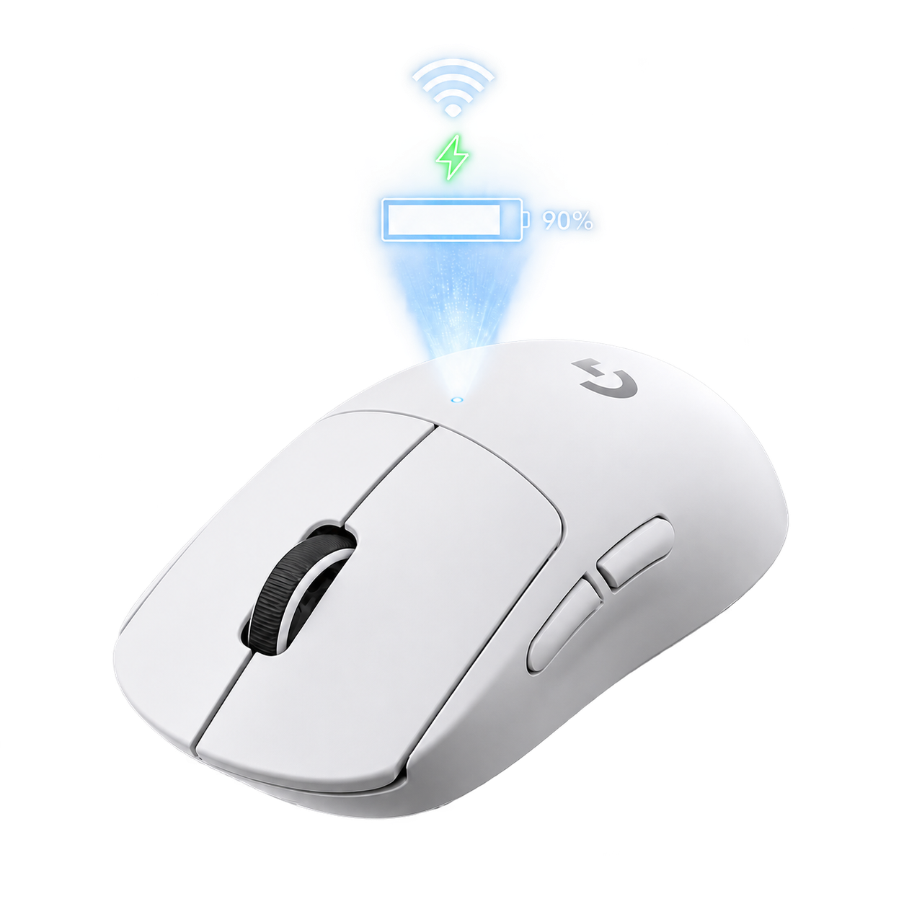
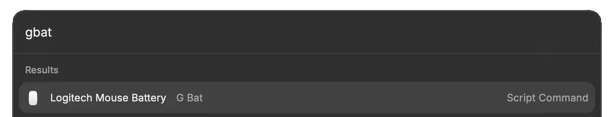

<p align="center">
  
</p>

<h1 align="center">gbat</h1>

<p align="center">
  <a href="README.md"><kbd>English</kbd></a>
  <a href="README.zh-CN.md"><kbd>简体中文</kbd></a>
</p>

Read the battery level and charging state of a Logitech G Pro Wireless 2 mouse on macOS.

```text
Battery: 78%
Battery: 42% (charging)
```

- Supports the LIGHTSPEED receiver and a direct USB connection
- Works in Terminal and Raycast
- Does not require Logitech G HUB, Python, or a background process
- Lets separate Terminal and Raycast invocations share HID access

## Requirements

- macOS 11 (Big Sur) or later
- A Logitech G Pro Wireless 2 connected through its LIGHTSPEED receiver or USB
- A mouse that is awake when `gbat` runs

## Install

The Homebrew package and GitHub release archive support Apple silicon (`arm64`)
only. The release binaries are unsigned and not notarized, so macOS may require
approval in System Settings > Privacy & Security.

Install the Apple silicon binary with Homebrew:

```sh
brew install softmaxe/tap/gbat
gbat --version
```

Upgrade or uninstall it with:

```sh
brew upgrade gbat
brew uninstall gbat
```

## Use

Run `gbat` with the mouse connected through its LIGHTSPEED receiver or USB:

```sh
gbat
```

The command writes one battery status line to stdout. Errors go to stderr and
return a non-zero exit status, so the output can be used in scripts.

<p align="center">
  
</p>

## Raycast

[`raycast/mouse-battery.sh`](raycast/mouse-battery.sh) is a Raycast Script Command. Add this repository's `raycast` directory in Raycast Settings, then run `Logitech Mouse Battery`.

<p align="center">
  
</p>

The script finds `gbat` on `PATH`, in the standard Homebrew directories, in `$HOME/.local/bin`, or in this project. If the binary is elsewhere, set its path explicitly:

```sh
export GBAT_BINARY="/path/to/gbat"
```

The legacy variables `GPWBAT_BINARY` and `GPW2_BATTERY_BINARY` remain supported.

## Build from source

Building requires Rust:

```sh
cargo build --release
./target/release/gbat
```

To run `gbat` from any directory, copy the binary to a directory on `PATH`:

```sh
mkdir -p "$HOME/.local/bin"
cp target/release/gbat "$HOME/.local/bin/gbat"
```

## Troubleshooting

| Problem | What to do |
| --- | --- |
| `No responsive Logitech HID++ interface found` | Connect the receiver or USB cable, wake the mouse, and retry. |
| `Could not initialize HID access` or an access error | Run `gbat` once from Terminal and approve any macOS permission prompt. `sudo` is not normally required. |
| `Battery: 100%` without `(charging)` | A full mouse may stop active charging. This is expected. |
| macOS blocks the binary | Open System Settings > Privacy & Security and choose Open Anyway for `gbat`. |

If Open Anyway does not work for a Homebrew installation, remove quarantine
from that formula only:

```sh
xattr -dr com.apple.quarantine "$(brew --prefix gbat)"
```

## How it works

`gbat` connects through Logitech's HID++ 2.0 vendor interface. It probes
Logitech HID++ interfaces, checks device indices `1` through `6` and `0xFF`,
then reads `UNIFIED_BATTERY` (`0x1004`) or falls back to `BATTERY_STATUS`
(`0x1000`). Invalid, incomplete, and missing responses return an error instead
of reporting `0%`.

Each release publishes a SHA-256 checksum and GitHub build provenance for its
archive. These do not replace Apple code signing or notarization. See the
[releases](https://github.com/softmaxe/gbat/releases) and
[release workflow](.github/workflows/release.yml) for the published files and
build checks.

## License

[GNU Affero General Public License v3](LICENSE), `AGPL-3.0-only`.
