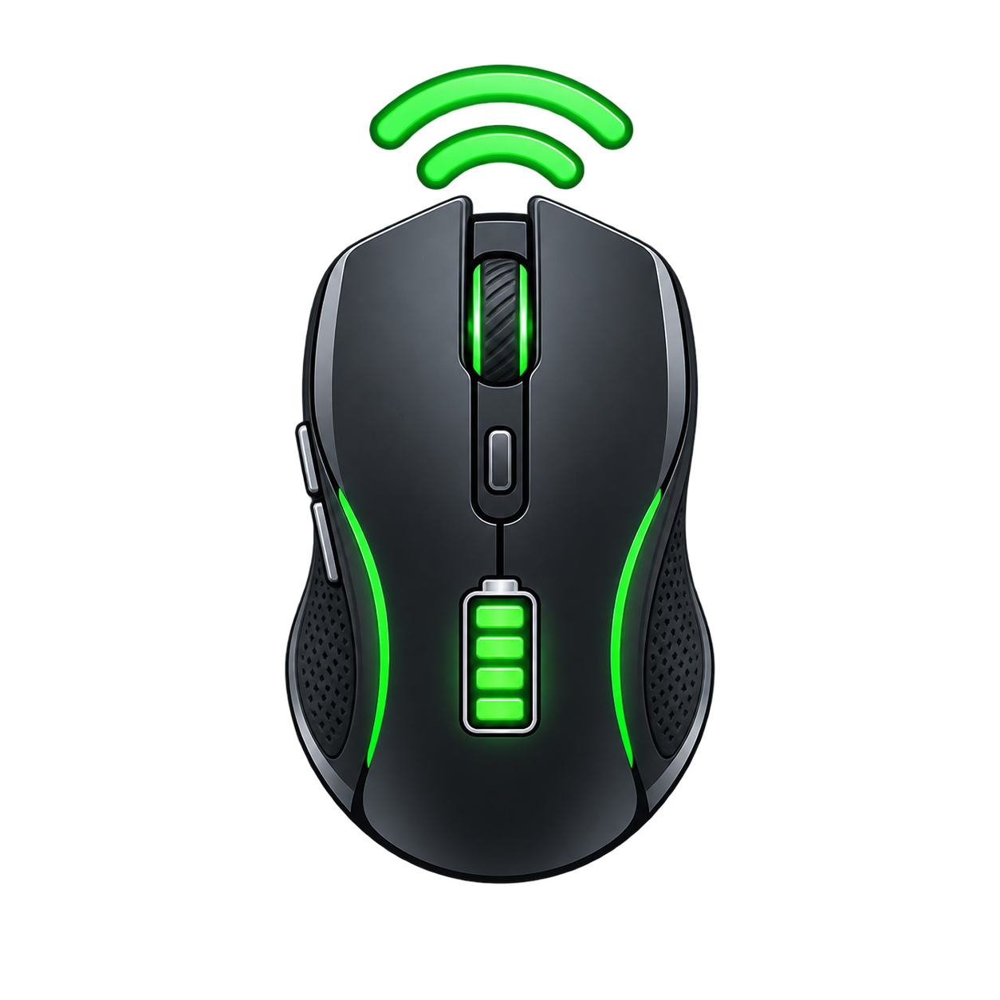

  

<h1 align="center">gpw2-battery</h1>

  <a href="README.md"><kbd>English</kbd></a>
  <a href="README.zh-CN.md"><kbd>简体中文</kbd></a>

gpw2-battery 是一个小型 macOS 命令行工具，用于读取 Logitech G Pro Wireless 2 鼠标当前的电量和充电状态。

它通过 Logitech HID++ 2.0 厂商接口与鼠标通信。不需要 Logitech G HUB、Python 或后台进程。同一个可执行文件既可以在 Terminal 中运行，也可以从 Raycast 调用。

macOS hidapi 后端使用共享设备访问，因此 Terminal 和 Raycast 的独立调用都可以打开 HID 接口，不会发生独占打开冲突。

## 支持的连接方式

- Logitech LIGHTSPEED 接收器
- 直接 USB 连接

运行命令时，鼠标必须处于唤醒状态并已连接到 Mac。

## 构建

构建项目需要 Rust。不安装 Rust 也可以直接使用预构建的可执行文件。

~~~
cargo build --release
~~~

可执行文件会写入 target/release/gpw2-battery。

## 从 Terminal 使用

直接在项目目录中运行可执行文件：

~~~
./target/release/gpw2-battery
~~~

成功时输出一行：

~~~
Battery: 78%
Battery: 42% (charging)
~~~

错误会写入 stderr，并返回非零退出状态。这样 stdout 可以供 shell 脚本使用，也能让 Raycast 保持简洁输出。

要从任意目录使用该命令，可以将发布版可执行文件复制到 PATH 中的目录，例如：

~~~
mkdir -p "$HOME/.local/bin"
cp target/release/gpw2-battery "$HOME/.local/bin/gpw2-battery"
~~~

## 从 Raycast 使用

仓库包含 raycast/mouse-battery.sh，可作为 Raycast Script Command 使用。将仓库的 raycast 目录添加到 Raycast 设置，然后运行 Logitech Mouse Battery。

脚本按以下顺序查找可执行文件：

1. `target/release/gpw2-battery`（当前项目中的可执行文件）
2. `gpw2-battery`（项目目录中的可执行文件）
3. `$HOME/.local/bin/gpw2-battery`
4. `/opt/homebrew/bin/gpw2-battery`
5. `/usr/local/bin/gpw2-battery`

如果可执行文件位于其他位置，请设置 GPW2_BATTERY_BINARY：

~~~
export GPW2_BATTERY_BINARY="/path/to/gpw2-battery"
~~~

脚本会直接执行可执行文件，绝不会运行 cargo run。

## 工作原理

命令会枚举 vendor ID 为 `0x046D`、usage page 为 `0xFF00` 的 Logitech HID 接口。它会探测 device indexes 1、2、3、4、5、6 和 `0xFF`，覆盖 GPW2 使用的接收器和 USB 直连路径。

对于每个有响应的接口，它会请求 HID++ `ROOT` 功能 (`0x0000`)，获取 `UNIFIED_BATTERY` (`0x1004`) 的功能索引。命令会先查询该功能。如果它不可用，或没有返回可用响应，命令会回退到 `BATTERY_STATUS` (`0x1000`)。电量读取自响应字节 `resp[4]`。`UNIFIED_BATTERY` 的充电状态位读取自 `resp[7] & 1`，`BATTERY_STATUS` 的充电状态位读取自 `resp[6] & 1`。

命令只有在长度较短的 HID++ 报告包含当前请求值所需的字节时才接受它们。错误报告和缺失响应都会被视为失败，绝不会被当作 0%。

## 故障排查

`No responsive Logitech HID++ interface found` 表示没有匹配的接口响应电池功能探测。请检查接收器是否已连接，或鼠标是否通过 USB 连接，然后唤醒鼠标并重试。

`Could not initialize HID access` 或 `access error` 可能表示 macOS 权限问题。请先从 Terminal 运行一次命令，并批准 macOS 显示的任何提示。在正常设置下，该命令不需要 `sudo`。

如果鼠标进入睡眠状态，请移动鼠标或点击按钮后重试。电量充满时可能显示 `Battery: 100%`，但没有 `(charging)`，因为鼠标已经不再处于充电状态。
